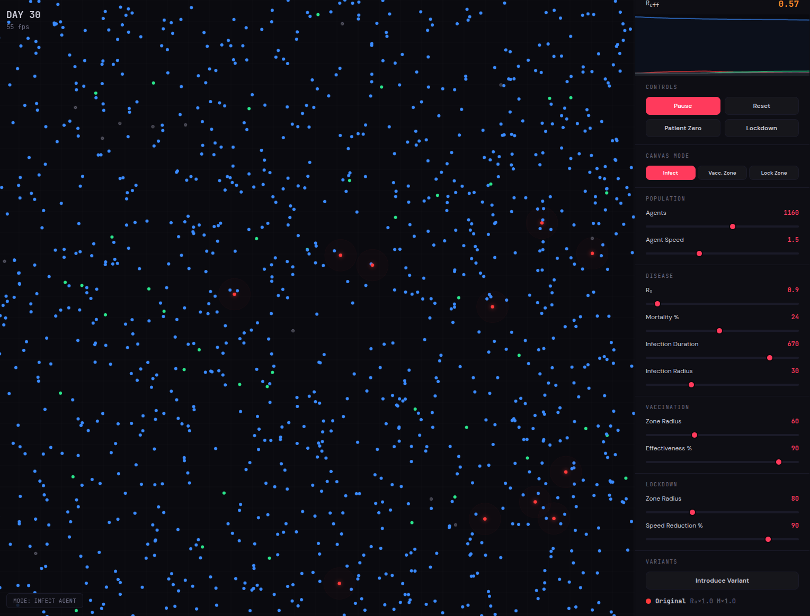

# Epidemic Simulation

A real-time 2D epidemic/disease spread simulation using an SIR model variant. Built with vanilla HTML, JS, and Canvas — zero dependencies, single file.

## Features

- **SIR Model** — Agents transition through Susceptible → Infected → Recovered/Dead states
- **Visual simulation** — Colored agents with infection radius glow, pulsing rings, and death markers on a dark canvas with grid overlay
- **Virus variants** — Introduce new variants mid-simulation with randomized R₀, mortality, and duration multipliers, each with a distinct color
- **Vaccination zones** — Click to place zones that gradually immunize susceptible agents passing through
- **Lockdown** — Global lockdown toggle or placeable lockdown zones that drastically reduce agent movement
- **Real-time stats** — Live S/I/R/D counts, R_eff tracking, day counter, and a line chart of population over time
- **Full control panel** — Sliders for population, speed, R₀, mortality, infection duration, infection radius, vaccination/lockdown parameters
- **Tooltips** — Hover over any `?` icon or button to learn what each control does

## Usage

Open `index.html` in a browser. No build step, no dependencies.

1. Click **Start** to begin the simulation
2. Click **Patient Zero** or switch to Infect mode and click an agent on the canvas
3. Watch the disease spread — place vaccination zones and lockdown zones to intervene
4. Introduce virus variants to see competing strains
5. Toggle global lockdown to flatten the curve

## Controls

| Control | Description |
|---|---|
| **Agents** | Number of agents (50–2000, takes effect on Reset) |
| **Agent Speed** | Base movement speed |
| **R₀** | Basic reproduction number — expected infections per case |
| **Mortality %** | Death probability when infection ends |
| **Infection Duration** | Ticks before recovery/death |
| **Infection Radius** | Transmission distance in pixels |
| **Vaccination Zone** | Place green zones that immunize passing agents |
| **Lockdown Zone** | Place amber zones that slow agents |
| **Introduce Variant** | Spawn a new strain with random properties |
